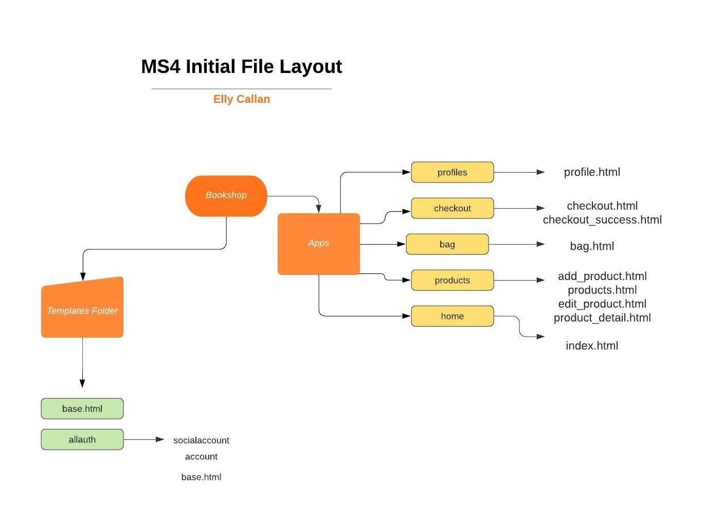
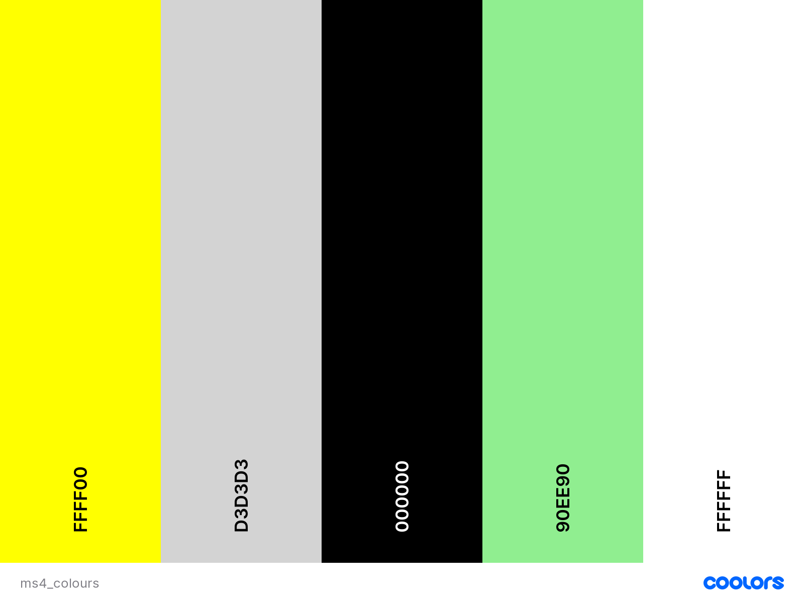

# The Book Store

![Am I Responsive Image]

## The Book Store is a fictional online book and supplies store. The stores purpose is to sell books, and other materials. These  materials could include arts and crafts supplies, notebooks, school supplies or home office products. The store will allow the owner to make more sales by moving to an online platform. 

#### The live website can be viewed [here](https://the-bookstore-ms4.herokuapp.com/)

<br>

## Table Of Contents 

- <a href="#ux">UX</a>
  - <a href="#user-stories">User Stories</a>
  - <a href="#strategy">Strategy</a>
  - <a href="#scope">Scope</a>
  - <a href="#structure">Structure</a>
- <a href="#database">Database</a>
- <a href="#wireframes">Wireframes</a>
- <a href="#surface">Surface</a>
- <a href="#crud">CRUD</a>
- <a href="#features">Features</a>
- <a href="#languages">Languages</a>
- <a href="#testing">Testing</a>
- <a href="#deployment">Deployment</a>
- <a href="#credits">Credits</a>

<br>

<span id="ux"></span>

## UX 

<span id="user-stories"></span>

### User Stories 

**As a New User**

* I want to be able to use the site intuitively. 
* I want to be able to search for products.
* I want to be able to view the details of individual products.
* I want to be able to order products by category.
* I want to be able to order products by finer details such as A-Z, price low to high or vice versa. 
* I want to be able to add products to my basket and checkout, without an account.
* I want to be shown messages throughout my journey through the site.
* I want to be able to register an account.

**As a Site Owner/Super User**

* I want to have a payment system implemented.
* I want to be able to edit product details.
* I want to be able to add new products.
* I want to encourage returning users by having an easy to use site.
* I want to have a contact form where users can send any questions.

**As a Returning User/Signed In User**

* I want to be able to edit my delivery address and information.
* I want to have a personalised profile that shows any previous orders.
* I want to be able to log in to a previously registered profile. 
* I want to be able to leave reviews for products.


<span id="strategy"></span>

### 1.Strategy 

**Project Goals**

* To make a full-stack site based around business logic used to control a centrally-owned database.
* To make a full-stack site that uses HTML, CSS, JavaScript, Python + Django.
* Creating a website that uses a relational database.
* Creating a website that uses Stripe payments.

**Site Owner Goals(Business Goals)**

* Creating a secure, professional and profitable e-commerce website.
* Inspire users to read more or read new books.

<span id="scope"></span>

### 2.Scope

* Fits in with my current skill-set of HTML, CSS, JavaScript, Python and Django.

<span id="structure"></span>

### 3.Structure

**As A New User (Not Logged In)**

A new user can visit:
  * The home page
  * Can access the register and login pages 
  * The products page
  * Sign up for newsletter on contact page
  * Specific category pages
  * The basket
  * The checkout
  * Contact form


**As A Registered User (Logged In)** 
A returning user can visit:
  * The home page
  * Can access the log out functionality
  * Profile, to save details and view previous orders.
  * Leave a review function
  * The products page
  * Sign up for newsletter on contact page
  * Specific category pages
  * The basket
  * The checkout
  * Contact form

**As Superuser (Site Owner)**
A superuser can visit:
  * The home page
  * Can access the log out functionality
  * Profile
  * Product management (Add a product)
  * Edit a product
  * Delete a product
  * Send a newsletter to subscribers
  * The products page
  * Specific category pages
  * The basket
  * The checkout
  * Contact form

<span id="database"></span>

### Database 

* During the development phase I used the sqlite3 database.
* For deployment, I used the PostgresSQL database which is provided by Heroku.

### Database Models

<br>

**Profile App**

**UserProfile model**

| **Name** | **Database Key** | **Field Type** | **Validation** |
--- | --- | --- | --- 
 User | user | OneToOneField |  User, on_delete=models.CASCADE
 Phone number | default_phone_number | CharField | max_length=20, null=True, blank=True
 Street address 1 | default_street_address1 | CharField | max_length=80, null=True, blank=True
 Street address 2 | default_street_address2 | CharField | max_length=80, null=True, blank=True
 Town/City | default_town_or_city | Charfield | max_length=40, null=True, blank=True
 Postcode | default_postcode | CharField | max_length=20, null=True, blank=True
 Country | default_country | CountryField | blank_label='Country', null=True, blank=True

**Checkout App**

**Order model**

| **Name** | **Database Key** | **Field Type** | **Validation** |
--- | --- | --- | --- 
 Order number | order_number | CharField | max_length=32, null=False, editable=False
 User profile | user_profile | ForeignKey | UserProfile, on_delete=models.SET_NULL, null=True, blank=True, related_name='orders'
 Full name | full_name | CharField | max_length=50, null=False, blank=False
 Email| email| EmailField | max_length=254, null=False, blank=False
 Phone number | phone_number | Charfield | max_length=20, null=False, blank=False
 Country| country | CountryField | blank_label='Country *', null=False, blank=False
 Postcode | postcode | CharField | max_length=20, null=True, blank=True
 Town/City | town_or_city | CharField | max_length=40, null=False, blank=False
 Street address 1 | street_address1 | CharField | max_length=80, null=False, blank=False
 Street address 2 | street_address2 | CharField | max_length=80, null=True, blank=True
 Date | date | DateTimeField | auto_now_add=True
 Delivery cost | delivery_cost | DecimalField | max_digits=6, decimal_places=2, null=False, default=0
 Order total | order_total | DecimalField | max_digits=10, decimal_places=2, null=False, default=0
 Grand total | grand_total | DecimalField | max_digits=10, decimal_places=2, null=False, default=0
 Original bag | original_bag | TextField | null=False, blank=False, default=''
 Stipe pid | stripe_pid | CharField | max_length=254, null=False, blank=False, default=''

**OrderLineItem model**

| **Name** | **Database Key** | **Field Type** | **Validation** |
--- | --- | --- | --- 
 Order  | order | ForeignKey | Order, null=False, blank=False, on_delete=models.CASCADE, related_name='lineitems'
 Product | product | ForeignKey | Product, null=False, blank=False, on_delete=models.CASCADE
 Quantity | quantity | IntegerField | null=False, blank=False, default=0
 Lineitem total | lineitem_total | DecimalField | max_digits=6, decimal_places=2, null=False, blank=False, editable=False

**Products App**

**Category model**

| **Name** | **Database Key** | **Field Type** | **Validation** |
--- | --- | --- | --- 
 name | name | CharField | max_length=254
 Friendly name | friendly_name | CharField | max_length=254, null=True, blank=True

**Product model**

| **Name** | **Database Key** | **Field Type** | **Validation** |
--- | --- | --- | --- 
 Category| category| ForeignKey | Category, null=True, blank=True, on_delete=models.SET_NULL
 Image | image | ImageField | null=True, blank=True
 Name | name | CharField | max_length=300
 Author | author | CharField | max_length=300, blank=True
 Description | description | TextField | null=True, blank=True
 Image url | image_url | URLField | max_length=1024, null=True, blank=True
 Price | price | DecimalField | max_digits=6, decimal_places=2

**ProductReview model**

| **Name** | **Database Key** | **Field Type** | **Validation** |
--- | --- | --- | --- 
 Product | product | ForeignKey | Product, null=True, blank=True, on_delete=models.SET_NULL, related_name='reviews'
 User | user | ForeignKey | User, null=True, blank=True, on_delete=models.CASCADE
 Title | title | CharField | max_length=254
 Content | content | TextField | 
 Rating | rating | IntegerField | choices=rating_selection, default=3
 Date Added | date_added | DateTimeField | auto_now_add=True

**Home App**

**Subscribers model**

| **Name** | **Database Key** | **Field Type** | **Validation** |
--- | --- | --- | --- 
 Email | email | EmailField | null=True
 Date | date | DateTimeField | auto_now_add=True

 **SubscriberEmail model**

 | **Name** | **Database Key** | **Field Type** | **Validation** |
--- | --- | --- | --- 
 Title | title | CharField | max_length=200, null=True
 Message | message | TextField | null=True

<span id="wireframes"></span>

### 4.Skeleton

**An inital layout of the file structure can be seen here.**



 **Desktop wireframes can be viewed [here](https://github.com/EllyC20/The-BookStore-MS4/tree/master/readme_images/wireframes/lg-device)**

 **Mobile wireframes can be viewed [here](https://github.com/EllyC20/The-BookStore-MS4/tree/master/readme_images/wireframes/sm-device)** 

 **Tablet or medium device sizes can be viewed [here](https://github.com/EllyC20/The-BookStore-MS4/tree/master/readme_images/wireframes/md-device)**

 **When viewing the wireframes there are some changes that should be noted, they are detailed below.**

<span id="surface"></span>

### 5.Surface

**Colours**

* I kept the colours of the site, consistent and subtle. The colours flow together nicely and allow easy use of the site without overwhelming the user. The colours hold positive connotations - yellow and green are associated as positive / success colours.



**Font**

* I used Roboto Mono for the body text, and Bebas Neue for headings, brand name or text that required attention. The two fonts go well together and I used Google Fonts to choose this pairing. They feel modern together and are not difficult to read on any screen size. 

**Images**

* The home page has a carousel which showcases images related to the purpose of the site. These images show books, immediately informing the user of what the site does. They're comforting images for people who enjoy reading, showing a relaxing atmosphere such as a libary.

<br>

## Features 

<span id="crud"></span>

### CRUD 

**Create** 

* Create functionality is provided for the superuser via product management. A site owner (superuser) can add a new product using a front-end form that will add the product to the database and visually to the front end.
* Create functionality is provided for logged in / registered users as they can add reviews to products.

<br>

**Read** 

* All users can read the information within the site.

<br>

**Update**

* Update functionality is provided for the superuser via the product page, using the "edit" button. Here the site owner can edit the products information on the site and database. 

<br>

**Delete**

* Delete functionality is provided to the superuser via the product page, using the "delete" button. Here the site owner can delete a product from the site and database.

<br>

<span id="features"></span>

### Current Features 

* Home page with carousel image.
* Footer with social media links and 2 common e-commerce pages (FAQ's and Returns)
* Product page with pagination 
* Product page features a "filter by" option allowing users to choose how they see products.
* Categories dropdown from Navbar, allowing the user to access specific categories.
* Product detail page showing details.
* A contact page that provides feedback to the user after the form is submitted.
* A newsletter sign up. 
* Superuser ability to send newsletters to subscribers.
* A functional checkout process that requires a user to complete a valid form.
* Stripe payments, with and without card authentication. (Test card numbers can be used to prompt an authentication request.)
* Toast messages throughout user journey.
* Confirmation emails of orders.
* Contact emails are sent to a "business" email address.
* Option to add reviews to products as a logged in user.


### Future Feautures

* Change newsletter to an API such as mailchimp, to send automated monthly or weekly updates.
* Social media login / registration.
* A wishlist or favourites option, where users can save items to their profile.
* A loyalty programme where users receieve free shipping after so many orders or build up points. 

<br>

<span id="languages"></span>

## Languages Used 

* [HTML5](https://en.wikipedia.org/wiki/HTML5) 
  -  Used for basic content structure.
* [CSS3](https://en.wikipedia.org/wiki/CSS) 
  - Used for styling content.
* [Python](https://www.python.org/) 
  - Used to implement backend development. 
* [jQuery](https://jquery.com/)
  - Used to initialize interactive features.

## Frameworks, Libaries & Other Tools Used 

* [Gitpod](https://www.gitpod.io/)
  - For development of the project.
* [Django](https://docs.djangoproject.com/en/3.2/)
  - Framework for this project.
* [Github](https://github.com/)
  - Used to store the project.
* [Git](https://git-scm.com/)
  - Used for version control.
* [Google Fonts](https://fonts.google.com/)
  - To implement the fonts used.
* [TinyPng](https://tinypng.com/)
  - To compress image sizes.
* [Balsamiq](https://balsamiq.com/)
  - To design wireframes.
* [Heroku](https://id.heroku.com/)
  - Cloud platform to deploy the project.
* [Coolors](https://coolors.co/palettes/trending)
  - To visualise a colour scheme.
* [Font Awesome](https://fontawesome.com/)
  - For any icons within the site.
* [cdnjs](https://cdnjs.com/)
  - To get Font Awesome linked.
* [Lucidchart](https://www.lucidchart.com/pages/) 
  - For images used in "Structure" section of README.
* [Am I Responsive](http://ami.responsivedesign.is/) 
  - For the image showing the site at the top of this README.

<br>

<span id="testing"></span>

## Testing 

All testing detail can be found [here.](https://github.com/EllyC20/The-BookStore-MS4/blob/master/TESTING.md) 

<span id="deployment"></span>

## Deployment 

### To Clone 

* The project can be run locally by cloning.
* Open the repositorie and click "Code", then select "clone".
* When you choose to clone you will be provided with a URL. Copy the URL from the "Clone with HTTPS" section.
* In your IDE, open Git Bash.
* Type Git Clone and then paste the URL you copied.
* Press enter and this will create the clone.

**Requirements**
* Python3
* GitHub account
* Heroku account
* Gitpod or an IDE of your choice
* Stripe account
* AWS Amazon account
* Gmail account

### Work With The Local Copy

* Ensure you have all of the above requirements set up.
* Go to the workspace of your local copy. In the CLI type: <code>pip3 install -r requirements.txt</code>
* Set up the environment variables: 
    - Create a `.gitignore` file in the root directory of the project. 
    - Create a `.env.py` file. To this add the following environmental variables.

    ```
    Import os
    os.environ("SECRET_KEY_MS4", "Added by developer")
    os.environ("STRIPE_PUBLIC_KEY", "Added by developer")
    os.environ("STRIPE_SECRET_KEY", "Added by developer")
    os.environ("STRIPE_WH_SECRET", "Added by developer")
    os.environ("DATABASE_URL", "Added by developer")
    ```
    - As an alternative to storing these enviromental variables in env.py, if you are working with Gitpod these can be stored in account settings accessed by visiting your workspaces. Click the profile icon, add the variables here and then correctly reference these within settings.
* Add the env.py file to gitignore.
* Next perform migrations to create the database. Do this by running the command <code>python3 manage.py makemigrations</code> followed by <code>python3 manage.py migrate</code>
* Create a superuser to have access to the admin panel. <code>python3 manage.py createsuperuser</code>
* Now run the app locally using <code>python3 manage.py runserver</code>

### Heroku Deployment 

* To deploy to Heroku, log in or sign up and create a new app.
* Complete the information regarding location and app name.
* Once this is done, go to resources and search for postgres and add this to your app.
* In your CLI install dj_database_url and psycopg2 so that you can use Postgres on your deployed site, install these using the following 
  <code>pip3 install dj_database_url
  pip3 install psycopg2</code>
* Log in using the CLI <code>heroku login -i</code>
* Migrate the database to postgres using <code>heroku run python manage.py migrate</code>
* Install gunicorn using <code>pip3 install gunicorn</code>
* Create a file called Procfile and ensure this is in it: 
```
web: gunicorn name_of_application.wsgi:application
```
* In settings set allowed hosts using 
```
 ALLOWED_HOSTS = ['app-name.herokuapp.com', 'localhost']
```
* In Heroku, select the deploy tab and under deployment method choose GitHub
* In connect to GitHub enter your GitHub repository details and when you see the correct one click connect.
* Go to the Settings tab and under Config Vars choose Reveal Config Vars, then enter the following config vars:


 

<br>

<span id="credits"></span>

## Credits 

### Content

* The description of the books on the product details page are taken from [Book Depository](https://www.bookdepository.com/)
* Home page content, is taken from [Waterstones About Us](https://www.waterstones.com/help/about-us/44) and edited slightly for educational purposes only.
* Footer / FAQ written by me. 
* Contact page, written by me. 

### Media 

* The stationary images (Office Supplies) are taken from [Pixabay](https://pixabay.com/)
* The book cover images are taken from a dataset on [Kaggle](https://www.kaggle.com/lukaanicin/book-covers-dataset)
* The home page carousel images are from [Pixabay](https://pixabay.com/)

### Acknowledgements

* To the Code Institute for the course content, and the last walk through project "Boutique Ado" which was used to implement some features.
* To Precious my mentor, for his time and guidance.
* To Tutor Support who have been extremeley helpful and willing with any questions.
* Slack community for providing help where possible.
* Stack Overflow for general queries.
