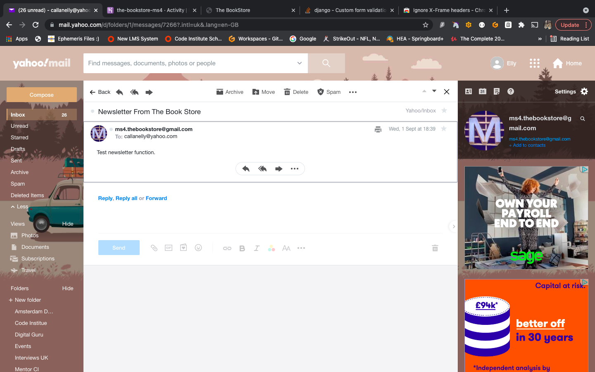

# Testing of The Book Store

## Testing Navigational Bar 

### Brand Name
* When I click the brand name "The Book Store" I expect to be taken to the home page. I tested this by using a laptop, Ipad and mobile device and physically clicking the brand name. By doing this I confirmed the expected results. 
### Navigational Links
* Within the navigational bar there are three main options, "All Products", "Categories" and "Contact". 
    * When clicking "All Products" I expect to be shown the products page which displays all products within the database. I tested this using a laptop, Ipad and mobile device and physically clicking the navigational link. I cross referenced the products with the database to confirm all were present. This confirmed all expected results.
    * When clicking "Categories" I expect to be shown a drop down menu featuring all of the categories listed within the database. I checked this by visiting the database and cross referencing the shown results. I tested this using a laptop, Ipad and mobile device and physically clicking the navigational link. This confirmed the expected results.
    * Choosing "Contact" brings the user to a contact page where a quick message can be sent. To test this functionality I filled in the form and checked the inbox of the email address I expected the email to go to. This confirmed the expected results, and the message from the user is received. 

 ## User And Basket 
 
### Testing The Basket
* When a user first visits the site they should see the basket icon and as they haven't added any items to the basket yet, it should be empty and this should be represented by a value of 0.00. To test this I visited the site and visually inspected. This confirmed the expected results. 
    * At this point if a user clicks the basket icon, they should be taken to the bag page and shown a message that says the bag is empty. They should also be provided with a button to go shop all products. To test this I visited the site and visually inspected. This confirmed the expected results. 
* When a user adds something to the basket, the value of 0.00 should change to reflect the item price plus postage if applicable. To test this I added an item to the basket and observed the results. This confirmed the anticipated results. 
    * From here if the user clicks the basket icon, they should be taken to the bag page. Within the bag page the items added to the basket should be shown. This information should include a product image, product name, the quantity chosen and a price. To test this I added three items to the basket with varying quantities. I visually inspected the site and this confirmed the expected results.
* Within the bag page there should the option to edit the quantity or remove the item entirely. To test this I visited the bag and altered the quantity by choosing a different quantity to the one initially added. This confirmed the expected update to the quantity, subtotal and total price. 
* To test the remove function, I clicked the red remove button. This confirmed the expected result of the item being removed from the bag.

## Checkout 

* When a user has items in the basket, the checkout button should be available. Upon clicking this they should be taken to a checkout page displaying a form to be filled in by the user for delivery details. To check this I added an item to my basket and visited the basket page. From here I could see the checkout button, upon clicking this provided the expected results.

### Checkout Form 

* Once the above step in checkout has been taken, and the user clicks the "checkout" button from the basket page. The user should then be taken to checkout where a form is available. The form needs to be filled out for the user to proceed further, I checked this by not completing all fields and clicking checkout. This action is not allowed.
* When the user has correctly populated the form information, they will then be asked for card details. For testing purposes with Stripe I used the card number "4242 4242 4242 4242" which doesn't require authentication. 
    * This card number is correctly allowed and a loading overlay is shown to the user, from here they are given confirmation of their order details. 
* To test Stripes authentication is required function, I used the card number 4000 0027 6000 3184. This loaded an authentication screen where the user can choose fail authentication or pass authentication. Choosing either choice results in the expected results. 
    * If a user fails authentication, they are shown an appropiate error message at card details.
    * If a user passes authentication, the checkout process continues as anticipated. 

### Email Confirmations Of Orders

* Once a user has placed an order and provided a vaild email address, they should be emailed an order confirmation with an order summary and the address the product is being shipped to. To test this I placed an order, provided a valid email address and then checked my emails. This confirmed the expected results.

 ## Testing the "CTA" (call to action) button on Home page
 * On the homepage there is a button shown on the carousel. The button says "Shop Now" and when clicked should take the user to the "All Products" page. I tested this by using a laptop, Ipad and mobile device and physically clicking the button. By doing this I confirmed the expected results.

## Superuser Functionality

* To test superuser functionality I logged in using the superuser log-in. I then clicked account, and "product management". When I did this I noted I hadn't pushed the correct url to Heroku so I commited and pushed this change. Once I had done this I tried again, and this took me to the "add product" form. To test I completed the form, clicked "add product" and upon doing so I expect to be redirected to the product detail page of the new product. Taking these steps confirmed the expected results. 

* Superusers also require the capacity to edit or delete products. This is easily accessed on the "product" page. Each card contains a footer with two buttons. Clicking the "edit" button brings you to the edit product page where a prepopulated form with all object data is displayed and available for editing. The superuser is also alerted via a toast message as to which product they are editing. Altering a detail and submitting the change works and is reflected in the product detail. 

* If a superuser clicks delete, currently the product will be removed from the database without a prompt. To improve user experience and avoid accidental deleting of products a fix needs to be implemented for this. <strong>UPDATE: 31/08/21. A delete modal is now in place, when a superuser chooses delete a modal will pop up allowing them to either confirm, or cancel their choice.</strong>

* A superuser (site owner) has the functionality to be able to send a newsletter to users who have subscribed via the contact page. To test this function, I logged in as superuser and ensured within the drop down "account" option there was an option named "Email Subscribers", upon clicking this I expected to be taken to a page where a form would be available. This form should have two areas to complete, title - for newsletter title and a content area. This confirmed the expected results. 
    - Prior to this I had signed up for the newsletter using a personal email.
    - I completed the form with a title of "Newsletter From The Book Store", and a message of "Test newsletter function." I then clicked "send newsletter" and received a success toast message informing me I had sent a newsletter.
    - I checked my emails and the newsletter with the content I had filled in was available - see image below.

## Profile

### Testing Registration Of A New User. 

* To test this function I visited the deployed Heroku app. I clicked "account" followed by "register". Upon clicking register I expect to be taken to a page containing a form where I will need to submit a valid email and password. Once I have correctly completed this form and clicked "sign-up" ath the bottom of the form, I should be redirected to a page alerting me that an email has been sent to the provided address for me to confirm sign-up. Once I visit my emails and follow the link to confirm and confirm the address, I should then be redirected to log in. 
    * To test this I took the above steps using a laptop, I recieved a confirmation email containing a link which brought me back to the site, I was able to confirm my email and log in successfully. 
    * As this account is <strong>not</strong> a superuser, I did not have access to "product management" from the account options nor could I see the edit / delete product buttons on the product page.

### Testing Log-In And Save Of Details
* As a registered user, a user can log in and visit a profile page. If the account is new (as in the steps above), in the profile there will be no saved address details and no order details. Once a user has made a purchase, their address details should be saved if they ticked the box "save to profile" under the checkout form. To test this I placed an order, and ticked the appropiate box. I then checked the profile and saw my details had been saved and I now had a recognised order linked to the account. 

### Log Out 
* Once I have clicked logout, I shouldn't be able to get back to the profile page using brute force. I tested this by logging out while on the profile page, then clicking the back button to attempt to get to the previous page. This resulted in me being redirected to the sign-in page. I also tested this by adding /profile to the end of the site URL, this also redirected me to the sign-in page.

 ## Footer 
 * Within the Footer, there are 2 navigational options for within the website and 2 social media icons. 

### Social Media Icons 
* The social media icons featured are Instagram and Facebook. When clicked they should take the user to the social media website in a new tab. I tested this by clicking the icons. Upon doing this I noted that I hadn't included links to the social media sites or the target "_blank" attribute. I fixed these errors and tried again. This confirmed the expected behaviour.

### Returns & FAQ Pages 
* Upon clicking the "Returns" link, users should be taken to the "Returns" page. I checked this by clicking the link, this confirmed the expected behaviours. 
* Upon clicking the "FAQ" link, users should be taken to the "FAQ" page. I checked this by clicking the link, this confirmed the expected behaviours. 

## Search Function 
* The expected behaviour of the search function is that, upon entering a valid input the site will be searched for a matching result. If there is no result the user should be informed of this. To test this I firstly entered the word "zoo" as I knew a book title matched this. The results confirmed the expected behaviour, I was shown one result named "Dear Zoo". The site url reflected the search, as it showed "?q=zoo" as anticiapted. 
* I then entered the word "grow" and this did not have any results. However this did not confirm the anticipated results as there was not an error message. ERROR MESSAGE FIX TO BE IMPLEMENTED.
* The search function should check the name of the book, the name of the author and also the description for the key word. 
    * I checked this was working by typing the name "Stephen" this gave two results of books both written by an author with the name Stephen. 
    * I then checked the description by using the word "learn", this gave one result and the word learn was within the description of this book.

## Fixed Bugs / Known Bugs 

* I encountered an error message from Gitpod upon trying to open my workspace that said "Last backup failed: workspace content was never ready." Within Github I could see the work committed along with a commit message but Gitpod did not recognise it. With the help of tutor support we managed to get the work back by undoing changes made, restoring files and finally a pull request. This ensured all work was up to date with the most recent commit. 
* Throughout the site, only success toast messages are working currently. (24/08/21) This will be looked into and fixed prior to submission. This is affecting basket toasts, and search toast for if no results have been found.
* When testing I noted that the product quantity selector on the basket page, was not correctly validating user input. A user could enter a negative number or a number above the specified highest amount. There is still a bug within this process which can be recreated using the below steps:
    * Add any item to the basket. 
    * Alter the quantity using the keyboard to enter an invalid number such as -10, -2, -3, 50, 100, etc. Then press <strong>ENTER</strong> on the keyboard. This correctly shows an error message and that validation is working.
    * However, if you repeat the step above and click <strong>UPDATE</strong>, rather than hitting enter. Then doing this allows for incorrect entering of numbers either negative or larger than allowed. This presents a problem for mobile users. This bug, I currently don't have a known fix for.

## Testing User Stories

**As a New User**

* I want to be able to use the site intuitively.
    - The site is clean, simple and easy to use. There's a common page structure used and easily recognised icons for features such as the basket or profile. 
* I want to be able to search for products.
    - The search bar provides this functionality for all users.
* I want to be able to view the details of individual products.
    - By visiting the products page, and choosing a product. This provides the product details.
* I want to be able to order products by category.
    - Within the navbar, there is a categories drop down option where a user can then choose which category to view.
* I want to be able to order products by finer details such as A-Z, price low to high or vice versa.
    - At the top of the products page, there is a dropdown box that provides the user with more options to filter the products.
* I want to be able to add products to my basket and checkout, without an account.
    - This is possible, delivery detail information will not be saved nor will a profile be created to show previous orders.
* I want to be shown messages throughout my journey through the site.
    - FIX FOR TOASTS TO BE IMPLEMENTED
* I want to be able to register an account.
    - The user can register by visiting the site, and choosing profile and selecting register, then completing the form and verifying the email address used.

**As a Site Owner/Super User**

* I want to have a payment system implemented.
    - Stripe payments system is implemented and fully functional. 
* I want to be able to edit product details.
    - This function is provided through the products page and selecting the "edit" button.
* I want to be able to add new products.
    - This function is provided through the product management option within the profile dropdown.
* I want to encourage returning users by having an easy to use site.
    - The site is intuitive, clean and straight forward.
* I want to have a contact form where users can send any questions.
    - A contact form is provided where emails are sent to the sites email address. This email provides the siteowner with the details to contact the user who sent the form.

**As a Returning User/Signed In User**

* I want to be able to edit my delivery address and information.
    - This can be done via the profile.
* I want to have a personalised profile that shows any previous orders.
    - This is visible in the profile if orders have been made.
* I want to be able to log in to a previously registered profile. 
    - This function is provided via the log in option.
* I want to be able to leave reviews for products.
    - Once logged in, by visiting a products detail page, this can be done.

## Responsiveness 

* To test responsiveness I used, devices such as an Ipad Pro 11", Iphone 8, Iphone 8 plus and a MacBook Air 13" and Google Chrome Developer tools. The results found and any further detail is below. 

**Large Devices**

| Screen Size       | 1920 x 1080 | 1920 x 1200 | 1440 x 900 | 1600 x 900 | 
|----------------|---------------|--------|---------|----------------|
| Renders As Expected | Yes | Yes  | Yes   | Yes  | 
| Images    | Good          | Good   | Good    | Good           | 

 

**Medium Devices**

| Screen Size       | 768 x 1024 | 1366 x 1024 | 600 x 960 | 1024 x 768 | 800 x 1280 |
|----------------|---------------|--------|---------|----------------|-----
| Renders As Expected | Yes | Yes   | Yes    | Yes | Yes |
| Images    | Good          | Good   | Good    | Good           | Good  |

 

**Small Devices**

| Screen Size       | 320 x 568 | 414 x 736 | 360 x 640 | 411 x 731 | 280 x 653 |
|----------------|---------------|--------|---------|----------------|-----
| Renders As Expected | Yes | Yes   | Yes    | Yes | Yes |
| Images    | Good          | Good   | Good    | Good           | Good  |

**Notes**
* There are some resposiveness issues with smallest screens (280 x 653) for example within the navbar, however this is slightly redundant as phones of that size in real world are hard to come by. This could definitely be improved with more time, specific media queries and a different approach to the layout of the navigational bar.